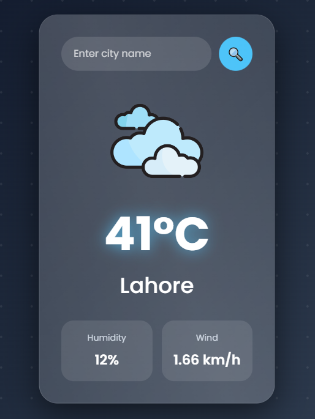

# 🌦️ SkyCast Weather App

A modern animated weather website built using HTML, CSS, and JavaScript with live weather API integration.

---

## 🚀 Live Demo
👉  https://officialalihassandev.github.io/weather-app/


## Screenshot



## 🚀 Features

- 🌍 Live Weather Data
- 📍 Auto Location Weather
- 🔍 Search Any City
- 🎨 Glassmorphism UI
- ✨ Full Animations
- 🖱️ Hover Effects
- 📱 Responsive Design
- ⚡ Fast & Lightweight

---

## 🛠️ Technologies Used

- HTML5
- CSS3
- JavaScript
- OpenWeather API

---

## 📸 Preview

Add your website screenshot here.

---

## 🔑 API Used

OpenWeather API

🌐 https://openweathermap.org/api

---

## 📂 Project Structure

```bash
weather-app/
│
├── index.html
├── style.css
└── script.js
```

---

## ▶️ How To Run

1. Download project
2. Open folder
3. Add your API key
4. Open `index.html`

---

## 👨‍💻 Author

Ali Hassan

GitHub:
https://github.com/OfficialAliHassanDev